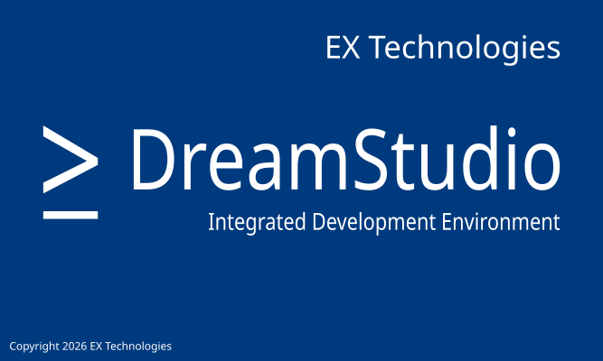
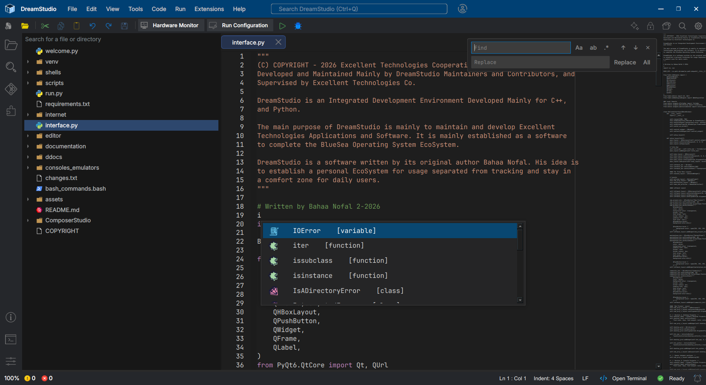

<h1 align="left" style="font-size: 40px;">DreamStudio IDE</h1>

DreamStudio is an open-source Integrated Development Environment developed by *Excellent Technologies* (known as _EX Technologies_) to develop, ship, and manage solutions of various programming languages.

## Programming Languages Hosted

DreamStudio is configured for local-interpreted programming languages, it is mostly used with *Python* to build various projects types. It comes, for each language, with a set of pre-configured project types and templates to help developers get-started quickly.

## Installation Guide
DreamStudio comes with DS-Installer. The tool required to set-up DreamStudio and install it. It is also the place to update the studio, install addons, and look at community-latest updates.

Once installed, open DreamStudio, you will be welcomed with a window that has two main options: *New Solution*, and *Open Template*. From here you can choose what you want and what helps you the most.

# Features
DreamStudio has some various built-in tools that powers its engine for interpreted programming languages. Here are some of the most impactful:

1. Custom and Powerful syntax highlighting and code-completion tools that work out-of-the-box for developers to manage large code-bases easier, with code formatting and pre-built-in code snippets.

2. Fast and Powerful debugging tools that work with the help of a trained specialized A.I "*Ether AI*" that is locally trained and hosted inside DreamStudio, it shows code suggestions, better syntaxing, suggestions, and detects errors and warnings fast. It can also refactor some changes for developers faster.

3. Building tools and Tools for verifying code safety and resources management for optimized experience.

DreamStudio is not only about these tools, it also comes with *extensions and addons* engine to allow developers to add their extensions they make.

# Contribution
If you want to contribute to DreamStudio, please read the provided documentation. Each DreamStudio version comes with a set of documentation tools to help developers and contributors find their way into the product.

# Additional Notes
DreamStudio is always under constant development and updating. Please, if you find any bugs, crashes, unexpected behaviors, features you want to add, or any other questions, feel free to get-in contact with us. Read the provided documentation for further details.